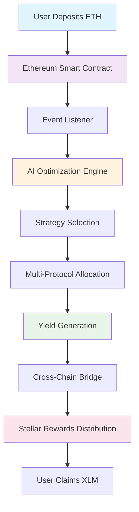

# Yieldspan - Intelligent Cross-Chain Yield Aggregator

> **Next-generation DeFi yield optimization powered by AI and cross-chain infrastructure**

> Demo: https://screen.studio/share/3g7B9YKM

Yieldspan is a cutting-edge yield aggregator that maximizes returns by intelligently allocating assets across multiple DeFi protocols. Users deposit ETH on Ethereum, our AI optimizes allocation across top yield sources, and rewards are distributed as XLM on Stellar Network.

[](https://opensource.org/licenses/MIT)
[](https://www.typescriptlang.org/)
[](https://soliditylang.org/)
[](https://www.rust-lang.org/)

## 🚀 **Live Demo**
 
🔗 **Ethereum Contract**: [0x661F616253621851052c668b030bE795638eA859](https://sepolia.etherscan.io/address/0x661F616253621851052c668b030bE795638eA859)  
⭐ **Stellar Contract**: [CC5K75G7UM6LNBV4ISEFEMYGPHC4AUNO72WVJWYTY777RJ3622P7WVGQ](https://stellar.expert/explorer/testnet/contract/CC5K75G7UM6LNBV4ISEFEMYGPHC4AUNO72WVJWYTY777RJ3622P7WVGQ)

---

## 🎯 **What Makes Yieldspan Special**

### 🧠 **AI-Powered Optimization**
- **Dynamic Strategy Selection**: Automatically chooses between Conservative, Moderate, and Aggressive strategies based on market conditions
- **Real-Time Rebalancing**: Continuously monitors and adjusts allocations across 5+ top DeFi protocols
- **Risk-Adjusted Returns**: Maximizes Sharpe ratio while maintaining user-defined risk tolerance

### 🌉 **Cross-Chain Infrastructure**
- **Seamless Bridging**: Deposit ETH on Ethereum, receive rewards in XLM on Stellar
- **Instant Settlements**: Sub-second transaction finality on Stellar Network
- **Lower Fees**: Leverage Stellar's ultra-low transaction costs for reward distribution

### 💎 **Multi-Yield Sources**
- **Lido Finance**: Liquid staking with 4-6% APY
- **Aave**: Lending protocol with 3-8% APY
- **Compound**: Decentralized lending with 3-6% APY
- **Uniswap**: Liquidity provision with 5-15% APY
- **Convex**: Boosted Curve rewards with 8-25% APY

---

## 🏗️ **System Architecture**



### 🔧 **Core Components**

#### 1. **Ethereum Layer** (Sepolia Testnet)
- **Smart Contract**: `ETHStakeBridge.sol` - Handles ETH deposits and emits events
- **Events**: Real-time monitoring of user deposits via `Staked` events
- **Security**: Includes emergency withdrawal functionality

#### 2. **AI Optimization Engine** (TypeScript)
- **Portfolio Optimization**: Modern Portfolio Theory with Sharpe ratio maximization
- **Risk Assessment**: Dynamic risk scoring based on protocol metrics
- **Strategy Selection**: Automated Conservative/Moderate/Aggressive allocation
- **Rebalancing**: Continuous monitoring and adjustment of positions

#### 3. **Cross-Chain Bridge** (Node.js)
- **Event Listening**: Real-time monitoring of Ethereum deposits
- **Stellar Integration**: Automatic XLM reward distribution
- **Transaction Relay**: Seamless cross-chain communication

#### 4. **Stellar Smart Contract** (Rust/Soroban)
- **Yield Vault**: Manages user balances and reward distribution
- **Strategy Storage**: Tracks individual user strategies
- **Reward Distribution**: Handles XLM payouts to users

---

## 💰 **Investment Flow**

### 1. **Deposit ETH**
```typescript
// User deposits ETH on Ethereum
function depositETH(amount: number) {
  // Converts to Wei and sends to smart contract
  const tx = await contract.stakeETH({ value: amount });
}
```

### 2. **AI Optimization**
```typescript
// System runs optimization algorithm
const strategy = await optimizer.optimize({
  amount: depositAmount,
  riskTolerance: userRiskProfile,
  marketConditions: currentMarketData
});
// Result: { lido: 0.4, aave: 0.3, compound: 0.2, uniswap: 0.1 }
```

### 3. **Cross-Chain Rewards**
```rust
// Stellar contract distributes XLM rewards
pub fn reward_user(env: Env, user: Address, amount: i128) {
    let balance = get_balance(&env, &user);
    set_balance(&env, &user, balance + amount);
}
```

### 4. **Claim Rewards**
```typescript
// User claims accumulated XLM rewards
async function claimRewards() {
  const rewards = await stellarContract.getClaimableRewards(userAddress);
  await stellarContract.claimRewards(rewards);
}
```

---

## 🛠️ **Quick Start**

### Prerequisites
- Node.js 22+
- Rust toolchain (for Stellar contracts)
- MetaMask wallet
- Freighter wallet (Stellar)

### Installation

```bash
# Clone the repository
git clone https://github.com/Yieldspan/Yieldspan.git
cd Yieldspan

# Install dependencies
npm i

# we can't share the .env, just take a guess :)
vim .env

# Compile contracts
npm run compile

# Start the development server
npm run dev
```

### Run Everything

```bash
./run-bridge.sh
./run-frontend.sh
```

---

## 📁 **Project Structure**

```
yieldspan-backend/
├── 🔧 contracts/               # Smart contracts
│   └── ETHStakeBridge.sol      # Ethereum staking contract
├── 🌉 bridge/                  # Cross-chain bridge
│   ├── bridgeServer.ts         # Main bridge server
│   ├── ethListener.ts          # Ethereum event listener
│   └── stellarReward.ts        # Stellar reward distribution
├── 🧠 src/                     # Core application logic
│   ├── allocation/             # Portfolio optimization
│   │   ├── optimizer.ts        # Modern Portfolio Theory
│   │   ├── analytics.ts        # Performance analytics
│   │   └── backtest.ts         # Historical backtesting
│   ├── arbitrage/              # Arbitrage detection
│   │   ├── fetchPrices.ts      # Price feed aggregation
│   │   └── simulateArbitrage.ts# Arbitrage simulation
│   ├── strategies/             # Investment strategies
│   │   ├── calculateYield.ts   # Yield calculations
│   │   ├── rebalancer.ts       # Portfolio rebalancing
│   │   └── strategySelector.ts # Strategy selection
│   └── portfolio/              # Portfolio management
│       └── portfolioManager.ts # User portfolio tracking
├── 🎨 frontend/                # React/TypeScript frontend
│   ├── src/
│   │   ├── main.ts            # Main application logic
│   │   ├── walletIntegration.ts# Wallet connectivity
│   │   ├── contractInterface.ts# Smart contract interface
│   │   ├── bridgeClient.ts     # Bridge communication
│   │   ├── portfolioManager.ts # Portfolio management
│   │   └── yieldSources.ts     # Yield source definitions
│   └── index.html              # Application entry point
├── 🌟 yield-vault/             # Stellar smart contracts
│   └── contracts/hello-world/  # Soroban contract
│       └── src/lib.rs          # Yield vault implementation
└── 🧪 test/                    # Test suites
    ├── allocation.test.ts      # Portfolio optimization tests
    ├── arbitrage.test.ts       # Arbitrage detection tests
    └── portfolio.test.ts       # Portfolio management tests
```

---

## 🌍 **Roadmap**

### Phase 0: PoC for Stellar Hack Pera
- [ ] Web interface deployment

### Phase 1: Core Platform ✅
- [ ] Cross-chain bridge implementation
- [ ] AI optimization engine
- [ ] Multi-protocol integration

### Phase 2: Advanced Features 🚧
- [ ] Layer 2 integration (Arbitrum, Polygon)
- [ ] Additional yield sources (Compound V3, Morpho)
- [ ] Advanced strategies (Delta neutral, Basis trading)
- [ ] Mobile application

### Phase 3: Enterprise 🔮
- [ ] Institutional API
- [ ] White-label solutions
- [ ] Compliance tools
- [ ] Advanced analytics dashboard

---

## 📄 **License**

This project is licensed under the MIT License - see the [LICENSE](LICENSE) file for details.

---

## 🙏 **Acknowledgments**

- **Stellar Development Foundation** for Soroban smart contract platform
- **Ethereum Foundation** for robust smart contract infrastructure
- **OpenZeppelin** for secure smart contract libraries
- **DeFi Protocols** (Lido, Aave, Compound) for yield opportunities

---

<div align="center">
  <p>
    <b>Built with ❤️ by the Yieldspan Team</b>
  </p>
</div>
