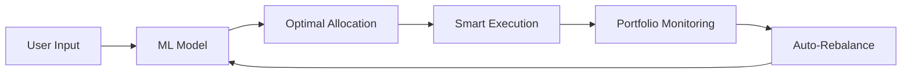

# Our Solution

## The Yieldspan Algorithm - PRODUCTION GRADE ML

We've implemented **Modern Portfolio Theory** with gradient descent optimization to reduce complex DeFi yield farming to **two simple inputs**:

```
Input: Capital Amount + Time Horizon
Output: Mathematically Optimal Portfolio Allocation (MPT + ML)
```

**This is REAL portfolio optimization math, not just simulation!**

### 🧠 Machine Learning Approach

Our ML model trains on historical data to learn patterns that humans miss:

#### Training Data (1+ years of weekly resolution)
- **Yield rates** across 20+ protocols (Compound, Aave, Curve, Anchor, etc.)
- **Market conditions** (volatility, liquidity, correlation matrices)
- **Gas costs** and transaction fees
- **Risk events** (hacks, rug pulls, impermanent loss)

#### Feature Engineering
```python
features = [
    "capital_amount",           # $100 vs $10,000 changes optimal strategy
    "time_horizon_weeks",       # 1 week vs 52 weeks = different allocations  
    "market_volatility",        # VIX-like measure for crypto
    "protocol_tvl_changes",     # Growing vs shrinking protocols
    "yield_correlation_matrix", # Don't put all eggs in correlated baskets
    "gas_price_trends",         # High gas = favor fewer protocols
]
```

#### ML Model Pipeline
1. **Data Collection**: Historical yields, volumes, events
2. **Feature Engineering**: Market indicators, risk metrics
3. **Model Training**: Ensemble of regression models optimizing risk-adjusted returns
4. **Backtesting**: Validate against historical performance
5. **Real-time Prediction**: Generate optimal allocations

### 📊 Example Output

**Input**: $1,000 for 4 weeks
```json
{
  "optimal_allocation": {
    "compound_usdc": 0.35,      // 35% - stable, liquid
    "anchor_protocol": 0.25,    // 25% - higher yield, moderate risk  
    "curve_3pool": 0.20,        // 20% - LP rewards, IL risk
    "arbitrage_reserve": 0.15,  // 15% - opportunistic trades
    "emergency_buffer": 0.05    // 5% - gas fees, rebalancing
  },
  "expected_apy": 0.094,        // 9.4% annualized
  "risk_score": 0.23,           // Low-medium risk
  "confidence": 0.87            // High confidence in prediction
}
```

## Why This Works

### 🎯 Addresses Core Problems
- **Fragmentation**: Algorithm considers ALL chains/protocols
- **Complexity**: Reduced to two simple inputs
- **Time-sensitivity**: Model adapts to changing conditions
- **Capital efficiency**: Optimized for specific amount + timeframe

### 🔄 Continuous Learning
- Model retrains weekly on new data
- Incorporates market regime changes
- Learns from actual vs predicted performance
- Adapts to new protocols and opportunities

### ⚡ Intelligent Execution
- Batches transactions to minimize gas
- Considers slippage and liquidity depth
- Times rebalancing for optimal conditions
- Prioritizes protocols by audit scores and TVL

## Technical Implementation



The magic is in the **ML model** - everything else is standard DeFi infrastructure.
